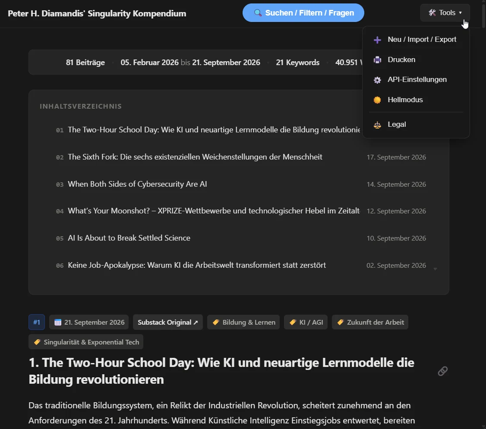
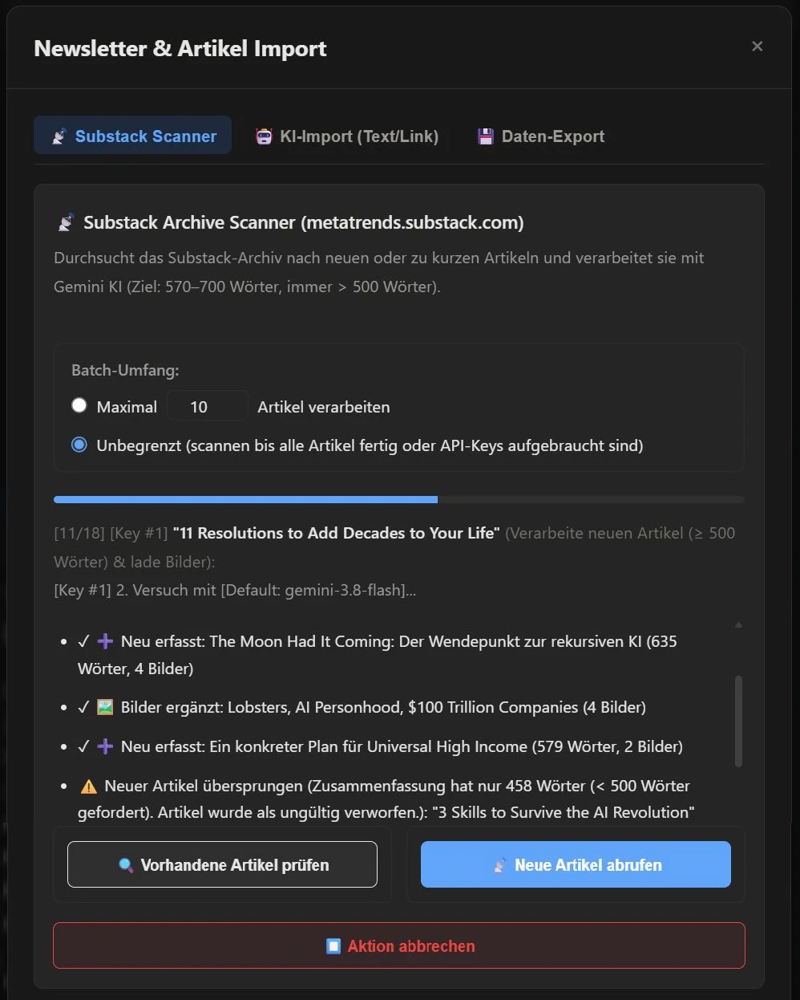
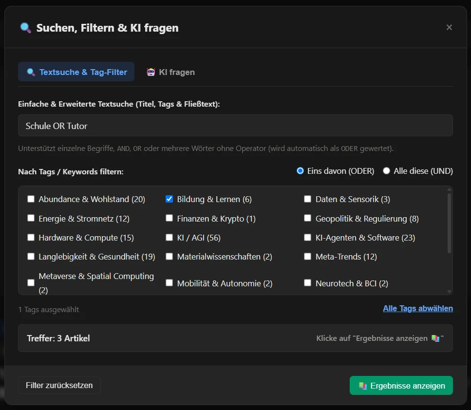
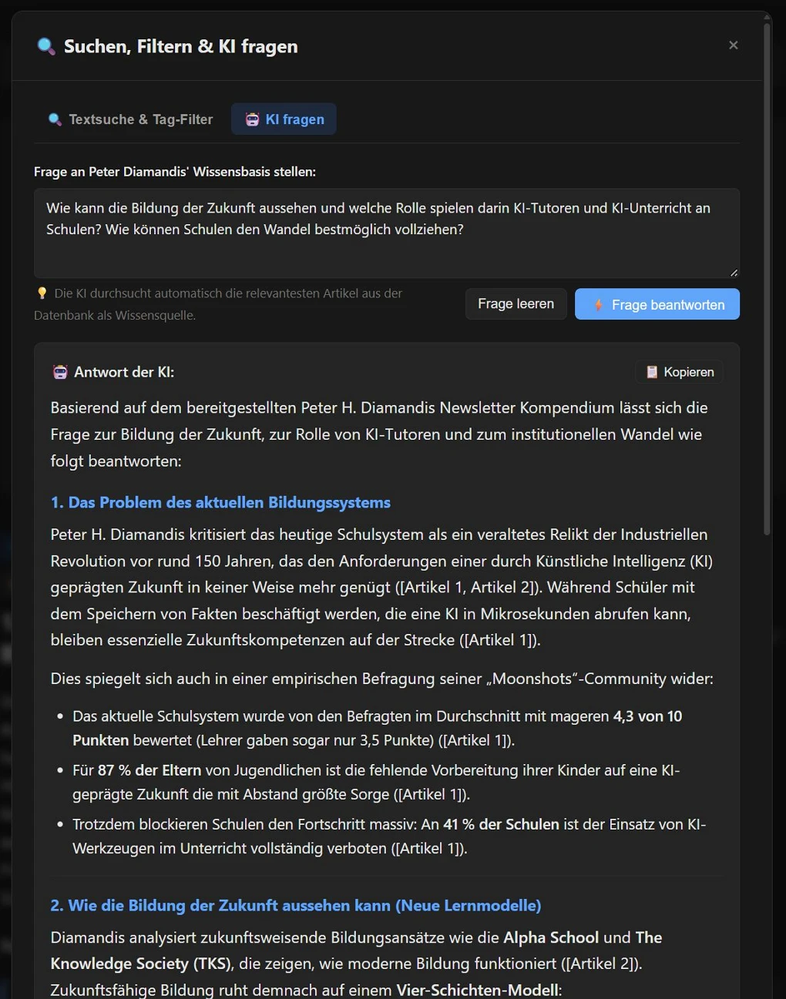

# 🔭 Peter H. Diamandis' Singularity Kompendium

> **Interaktives, KI-gestütztes Lese- und Recherche-Kompendium** für die Zukunfts- und Singularitäts-Essays von Peter H. Diamandis — mit RAG-Q&A, Substack-Crawler und cleverer API-Key-Verwaltung.

[](https://singularity-kompendium.hannes-schurig.de/)
[](LICENSE)

---

## 📸 Screenshots

| Artikelübersicht | Artikel-Detailansicht |
|:---:|:---:|
|  |  |

| KI-Assistent (RAG Q&A) | Substack-Scanner & Admin |
|:---:|:---:|
|  |  |

---

## 📖 Projektbeschreibung

Das **Singularity Kompendium** ist eine interaktive, KI-gestützte Wissensplattform und Lese-Applikation, die alle Substack-Artikel des Zukunftsforschers und Unternehmers **Peter H. Diamandis** erfasst, in **deutscher Sprache** zusammenfasst und intelligent durchsuchbar aufbereitet.

Entwickelt als performante, kompromisslose **Zero-Dependency Single-Page-Application**, kombiniert das System ein elegantes, Notion-inspiriertes Leseerlebnis mit einem leistungsfähigen KI-Backend, das Artikel in **22 zukunftsweisende Technologiefelder** strukturiert und fundierte Zusammenfassungen bereitstellt.

Herzstück der Plattform ist eine vollständig **clientseitig operierende KI-Engine mit Retrieval-Augmented Generation (RAG)**, die komplexe Fragen über den gesamten Artikelbestand präzise beantwortet und Quellen referenziert. Ergänzt wird dies durch einen automatisierten Substack-Archiv-Scanner mit intelligenter Gemini-API-Key-Verwaltung, mehrstufiger Modell-Fallbackkaskade, automatischem Bild-Scraping sowie einem sicheren PHP-Sync-Backend.

**Aktueller Datenstand:** 99 kuratierte Artikel (Stand: September 2026)

---

## ✨ Features & Highlights

| # | Feature |
|---|---------|
| 1 | **Client-Side AI RAG & Q&A-Assistent** — Beantwortet komplexe Nutzerfragen semantisch auf Basis der kuratierten Artikeldatenbank mit Google Gemini und Quellenverweisen |
| 2 | **Autonomer Substack-Archiv-Crawler** — Durchsucht `metatrends.substack.com` bis zu 100 Artikel tief, erkennt neue und unvollständige Einträge automatisch |
| 3 | **Multi-Tier Proxy-System für CORS-Bypass** — Eigenes Same-Origin PHP-Skript mit automatischer Fallback-Kette für externe Inhalte |
| 4 | **Intelligente Multi-Key-Rotation & Quota-Management** — Verwaltet beliebig viele Google AI Studio API-Keys mit nahtloser Rotation bei Quota-Limits (HTTP 429) |
| 5 | **3-Modell-Überlastungskaskade mit Countdown-Backoff** — Automatischer Wechsel zwischen bis zu 4 Gemini-Modellen bei Serverüberlastung (HTTP 503) |
| 6 | **Differentielles Qualitäts-Gate** — Neue Artikel ≥ 500 Wörter (Ziel: 570–700), Retry-Loop mit Draft-Injection bei Unterschreitung |
| 7 | **Kontext-Bilderscraping, Hero-Detection & Lightbox-Galerie** — Automatische Extraktion von Titelbildern (OpenGraph) und Kontext-Grafiken mit Zoom-Lightbox |
| 8 | **22 Kanonische Metatrend-Kategorien** — Von AGI bis Raumfahrt, mit automatischer Fuzzy-Tag-Normalisierung |
| 9 | **Erweiterte Boolesche Volltextsuche** — AND / OR / UND / ODER Operatoren, Klammerung und kombinierte Tag-Filter |
| 10 | **Zero-Dependency Single-Page-Architecture** — 0 npm- oder Pip-Abhängigkeiten, 100% natives Vanilla JavaScript (ES6+) |
| 11 | **Zwei-Wege Server-Sync & Rollierende Backup-Engine** — Sicheres PHP-Backend mit verschlüsseltem Admin-Token und automatischen Backups |
| 12 | **Adaptive Theme-Engine** — Dark/Light-Mode mit OS-Präferenz-Erkennung |
| 13 | **Drucklayout & 1-Klick Markdown-Export** — `@media print`-Regeln und strukturierter Markdown-Export für Obsidian / Notion |

---

## 📊 Projektstatistiken

| Metrik | Wert |
|--------|------|
| Gesamtumfang | ~6.300+ Zeilen Code (LOC) |
| Frontend (`index.html`) | 4.625 Zeilen (JS + CSS + HTML) |
| Backend (`api.php` + `config.php`) | 567 Zeilen PHP |
| CLI-Engine (`diamandis-ingest.py`) | 747 Zeilen Python |
| Proxy (`proxy.php`) | 79 Zeilen PHP |
| Projektdateien | 10 Dateien |
| Taxonomie | 22 kanonische Metatrend-Kategorien |
| Kuratierte Artikel | 99 (Stand: September 2026) |
| Abhängigkeiten | **0** (Zero-Dependency) |

---

## 🗂️ Dateistruktur

```
singularity-kompendium/
├── index.html              # Frontend SPA (Vanilla JS + CSS)
├── diamandis-data.js       # Artikeldatenbank (JS-Exportdatei)
├── diamandis-data.backup.js # Automatisches Backup der Datenbank
├── api.php                 # Sicheres PHP-Backend (Sync, Backup, Bilderverwaltung)
├── proxy.php               # Same-Origin CORS-Proxy für Substack
├── config.php              # Serverkonfiguration (NICHT in Git)
├── config.example.php      # Konfigurationsvorlage
├── diamandis-ingest.py     # Python CLI für Batch-Verarbeitung
├── images/                 # Gecrawlte Artikelbilder (NICHT in Git)
├── screenshots/            # README-Screenshots
└── .gitignore
```

---

## ⚙️ Setup

### Voraussetzungen

- **Webserver** mit PHP 7.4+ (für Server-Sync, Proxy und Bilderverwaltung)
- **Google AI Studio API-Key(s)** — kostenlos unter [aistudio.google.com](https://aistudio.google.com)
- Optional: Python 3.9+ für die CLI-Ingestion (`diamandis-ingest.py`)

> **Hinweis:** Das Frontend (`index.html`) funktioniert auch als **reine statische Datei** ohne PHP-Backend — dann sind Server-Sync und Substack-Crawler deaktiviert.

---

### Option A: Vollständige Server-Installation (empfohlen)

**1. Repository klonen:**
```bash
git clone https://github.com/schurigh/stuff.git
cd stuff/singularity-kompendium
```

**2. `config.php` aus der Vorlage erstellen:**
```bash
cp config.example.php config.php
```

**3. `config.php` anpassen:**
```php
<?php
// Pfad zum Verzeichnis dieser Datei (absoluter Serverpfad)
define('BASE_PATH', '/var/www/html/singularity-kompendium/');

// Admin-Passwort für API-Zugriff (wähle ein starkes Passwort!)
define('ADMIN_PASSWORD', 'dein-sicheres-passwort');

// Erlaubte Origins für CORS (deine Domain)
define('ALLOWED_ORIGIN', 'https://deine-domain.de');
?>
```

**4. Dateien auf den Webserver hochladen** (alle außer `config.php`, steht bereits in `.gitignore`).

**5. Im Browser öffnen** → Unter ⚙️ Einstellungen deinen Gemini API-Key und Admin-Passwort eintragen.

---

### Option B: Lokale Nutzung (statisch, ohne Backend)

Einfach `index.html` im Browser öffnen. Server-Sync und Substack-Crawler sind dann nicht verfügbar, aber Lesen, Suchen und RAG-Q&A funktionieren vollständig.

---

### Option C: Python CLI für Batch-Ingestion

Für die Massenverarbeitung von Artikeln ohne Browser:

```bash
pip install google-generativeai requests
python diamandis-ingest.py
```

Die CLI fragt interaktiv nach dem Gemini API-Key und verarbeitet neue Artikel direkt in `diamandis-data.js`.

---

### API-Keys verwalten

Im Frontend können unter **⚙️ Einstellungen → API-Keys** mehrere Google AI Studio Keys hinterlegt werden. Das System rotiert automatisch bei Quota-Erschöpfung. Empfehlung: Mindestens 2–3 Keys für unterbrechungsfreie Batch-Verarbeitung.

---

### Datenbank (`diamandis-data.js`) anpassen

Die Artikeldatenbank ist eine einfache JavaScript-Exportdatei:

```javascript
const diamandisData = [
  {
    id: "artikel-slug",
    title: "Artikeltitel",
    date: "2026-01-15",
    url: "https://metatrends.substack.com/p/...",
    summary: "Deutsche Zusammenfassung (min. 500 Wörter)...",
    tags: ["KI", "Robotik"],
    images: ["https://..."]
  },
  // ...
];
```

Du kannst eigene Artikel manuell eintragen oder den integrierten Substack-Scanner im Frontend nutzen.

---

## 🔒 Sicherheitshinweise

- `config.php` enthält das Admin-Passwort und ist in `.gitignore` — **niemals committen!**
- `api.php` schützt alle Schreiboperationen mit `hash_equals()` gegen Timing-Angriffe.
- `proxy.php` erlaubt nur Anfragen an `*.substack.com` (SSRF-Schutz).
- API-Keys werden ausschließlich im `localStorage` des Browsers gespeichert — niemals serverseitig.

---

## 📋 Lizenz

Dieses Projekt steht unter der **MIT-Lizenz** — du kannst es frei nutzen, modifizieren und weitergeben, solange der ursprüngliche Copyright-Hinweis erhalten bleibt.

```
MIT License

Copyright (c) 2026 Hannes Schurig

Permission is hereby granted, free of charge, to any person obtaining a copy
of this software and associated documentation files (the "Software"), to deal
in the Software without restriction, including without limitation the rights
to use, copy, modify, merge, publish, distribute, sublicense, and/or sell
copies of the Software, and to permit persons to whom the Software is
furnished to do so, subject to the following conditions:

The above copyright notice and this permission notice shall be included in all
copies or substantial portions of the Software.

THE SOFTWARE IS PROVIDED "AS IS", WITHOUT WARRANTY OF ANY KIND, EXPRESS OR
IMPLIED, INCLUDING BUT NOT LIMITED TO THE WARRANTIES OF MERCHANTABILITY,
FITNESS FOR A PARTICULAR PURPOSE AND NONINFRINGEMENT. IN NO EVENT SHALL THE
AUTHORS OR COPYRIGHT HOLDERS BE LIABLE FOR ANY CLAIM, DAMAGES OR OTHER
LIABILITY, WHETHER IN AN ACTION OF CONTRACT, TORT OR OTHERWISE, ARISING FROM,
OUT OF OR IN CONNECTION WITH THE SOFTWARE OR THE USE OR OTHER DEALINGS IN THE
SOFTWARE.
```

---

## ⚠️ Disclaimer

- Dieses Projekt ist ein **inoffizielles Fan-Projekt** und steht in keiner Verbindung zu Peter H. Diamandis, dem Diamandis-Unternehmen oder Substack.
- Die deutschen Zusammenfassungen werden durch **Google Gemini AI** generiert und sind keine offiziellen Übersetzungen. Inhaltliche Abweichungen vom Original sind möglich.
- Die Nutzung der Substack-API erfolgt gemäß den öffentlich zugänglichen Endpunkten. Für die Einhaltung der jeweiligen Nutzungsbedingungen ist der Nutzer selbst verantwortlich.
- Gecrawlte **Bilder und Inhalte** unterliegen dem Copyright der jeweiligen Urheber.

---

## 👤 Autor

**Hannes Schurig**
- 🌐 Portfolio: [portfolio.hannes-schurig.de](https://portfolio.hannes-schurig.de)
- 💻 GitHub: [@schurigh](https://github.com/schurigh)
- 🔭 Live-Demo: [singularity-kompendium.hannes-schurig.de](https://singularity-kompendium.hannes-schurig.de/)

---

*Made with ☕, ♥️ and way too much Gemini API quota.*
